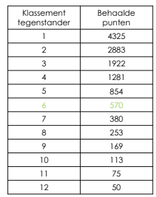
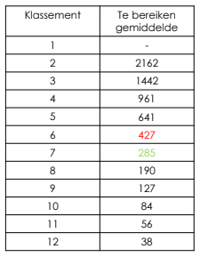
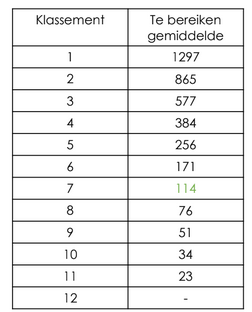

# Info
* Video: https://www.youtube.com/watch?v=sJYd50_lLos
* slides in PDF: https://drive.google.com/file/d/1-5HvW7DaA8z2sUvy93_s_l7_7Wgz-lXG/view


# Klassement: 
* 1 (hoogste)-12(laagst)
    * geen 1-1 convertie tussen oud & nieuw
    1 = top A
    2 = A
    3 = A / top B1
    4 = B1

* enkel belgische toenooien & interclubs voor volwassenen tellen mee

# Basisprincipes
* _gemiddelde_ van behaalde punten bepaalt ranking & klassement
* onderscheid tussen gemiddelde voor stijgen & dalen
    * stijgen >75% gewonnen tegen eigen klassement
    * dalen <30% gewonnen tegen eigen klassement
* behaalde punten afhankelijk van klassement tegenstander
* bescherming tegen dalen indien inactief
* gekoppelde klassement: max 2 klassementen verschil tussen disciplines
* tweemaandelijke klassementswijziging: jan-maart-mei-juli-sept-nov

# Regels in detail
## Gemiddelde
```
         sum(punten geldige wedstrijden in rekening gebracht van laatste 52 weken)
gem =  -------------------------------------------------------------------------
                  aantal geldige wedstrijden in rekening gebracht laatste 52 weken
```
## Definitie geldige wedstrijden
## Punten
* Hoe punten krijgen in enkel?
    * verliezen = 0 punten
    * winnen: 
    * winnen: 
* Hoe punten krijgen in dubbel/gemengd?
    * verliezen:0 punten
    * winnen: gemiddelde klassement tegenstanders voor beide winnaars
    

## Stijgen
* grenswaardes

* max 1 stijging per wijziging
* In rekening gebracht wedstijden = alle geldige wedstrijden _UITGEZONDERD_
    *  (enkel) wedstrijd _verloren_ van tegenstander met meer dan 1 klassement hoger
    *  (dubbel) wedstrijd _verloren_ van tegenstanders met gemiddeld klassment meer dan 1 klassement hoger
    *  wedstrijden _gewonnen_ die het gemiddelde verlagen
* correctie indien minder dan 7 wedstrijden
```
         sum(punten geldige wedstrijden in rekening gebracht van laatste 52 weken)
gem =  -------------------------------------------------------------------------
                  7
```


## Dalen
* grenswaardes

* max 1 daling per wijziging
* In rekening gebracht wedstijden = alle geldige wedstrijden _UITGEZONDERD_
    *  (enkel) wedstrijd _verloren_ van tegenstander hoger klassement
    *  (dubbel) wedstrijd _verloren_ van tegenstanders met hoger gemiddeld klassement
    *  wedstrijden _gewonnen_ die het gemiddelde verlagen    
* bescherming tegen inactiviteit
    * inactief = minder dan 3 wedstrijden in discipline in afgelopen 103 weken
    * inactief na 103 weken -> eenmalig 2 klassementen dalen
    
    
    
## Interclub competitie: C320 (video: 45:16)
* index speler = klassement speler
* totaal index speler
    * (heren/dames) = klassement(enkel) + klassement(dubbel)
    * (gemend) = klassement(enkel) + klassement(dubbel) + klassement(mix)
* C320 art.52
    * spelers opgesteld in volgorde van _oplopende_ index
* titularis (C320 art.53)
    * opstelbaar indien totaal index niet _lager dan laagste_ totaalindex  
* seizoen 2019-2020 overgangsjaar
    * basisopstelling adhv. huidige klassement systeem 02/03/2020  -> speelgerechtigheid (titularis mogelijk of niet)
    * klassementen adhv. nieuw systeem -> opstelling op blad
    
        
## Opstellingsapp
Q: Wat indien speler geen vaste ranking eind mei heeft gekregen?
Vroeger bepaalde de opstellingsapp dat fixedRanking gelijk werd gezet als variableRanking indien fixedRanking ontbrak.
In seizoen 20-21 (overgangsjaar), kan je zoiets echter niet doen omdat er geen exacte omvorming mogelijk is nieuw-naar-oude ranking

Q: Teamindex van de effectieve ploeg mag de teamindex van papieren ploeg niet overschrijden (C320 art. 53.2)
* Teamindex van de effectieve ploeg: obv. nieuwe ranking systeem
* Teamindex papieren ploeg: obv. oud ranking system
Die twee kunnen toch zomaar niet met elkaar vergeleken worden?
A: Teamindex effectieve ploeg wordt bepaald obv. fixedIndexes


TODO
* check "Teamindex effectieve ploeg" : done, fixed
* check specific small-device functionality: done, checked on Nokia

vorig seizoen
PBO_COMPETITIE_ID='DB2CA04D-D29F-4538-B46C-92A24A83B68B'
PBO_COMPETITIE_START_DAY='20200801'
PBO_COMPETITIE_END_DAY='20210731'